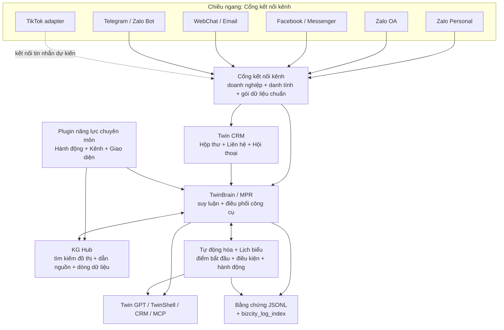

# BTcare CRM - Nền tảng CRM + trợ lý AI đồng hành

> **Current product focus — Zalo Personal first:** BT Twin is being
> hardened around the real daily workflow of **Zalo Cá nhân** (QR/session
> ownership, cross-site status, customer-care Inbox, message/media fidelity
> and reliable sending). Zalo OA and Facebook/Fanpage assets follow as
> business-owned channels managed centrally; Zalo Bot, Telegram and TwinChat
> remain supporting/admin expansion surfaces. This priority changes sequencing,
> not the shared Channel → CRM → Brain architecture: every later channel must
> reuse the same contracts, identity scope, audit and delivery evidence.

> **All Channel, One Brain.** Xây dựng ứng dụng AI, plugin nghiệp vụ và hệ thống omni-channel trên một bộ não doanh nghiệp thống nhất.

**BT Twin** là nền tảng mã nguồn mở giúp biến WordPress thành **Bộ não thứ 2 cho doanh nghiệp**: tiếp nhận dữ liệu đa kênh, hợp nhất danh tính và dữ liệu doanh nghiệp, xây đồ thị tri thức, suy luận có bằng chứng, tự động hóa công việc và cung cấp dữ liệu có kiểm soát cho Claude, ChatGPT hoặc trợ lý AI qua MCP.

Đây không phải một chatbot đóng gói. Đây là nền tảng để cộng đồng phát triển CRM, trợ lý bán hàng, chăm sóc khách hàng, bán hàng qua mạng xã hội, quản trị nội bộ, báo cáo và AI chuyên ngành trên cùng một kiến trúc.

<div align="center">

**All Channel, One Brain · Đồ thị tri thức · Tự động hóa · MCP · WordPress**

[](bizcity-twin-ai.php)
[](https://www.php.net/)
[](https://wordpress.org/)
[](LICENSE)
[](#một-kiến-trúc-ba-trục)

[Xem bản dùng thử](https://libedemo.bizcity.vn/gpt/) · [Nguyên tắc phát triển](.github/copilot-instructions.md) · [Đóng góp mã nguồn](CONTRIBUTING.md) · [Lịch sử phát hành](CHANGELOG.md)

</div>

---

## Tuyên ngôn

> **All Channel, One Brain.**

Đây là tuyên ngôn chung cho toàn hệ thống: mọi kênh, dữ liệu, chức năng và nhu cầu của doanh nghiệp cùng được kết nối về một bộ não để hiểu, quyết định và hành động nhất quán.

Nguyên tắc triển khai cho Dev là cách hiện thực hóa tuyên ngôn đó:

> **Muốn thêm khả năng, hãy thêm plugin. Không sửa Core.**

> **Directive:** Johnny Chu - Chu Hoàng Anh · 2026-09-13. Mọi plugin mới hoặc
> plugin migrate dữ liệu phải khai báo `extension-storage-context@1.0.0` trước
> khi thêm bảng/file/option/usermeta/CPT/KG artifact.

Core giữ những năng lực dùng chung và nhạy cảm: danh tính, ranh giới dữ liệu doanh nghiệp, trí nhớ, đồ thị tri thức, Cổng LLM, suy luận, quyền truy cập, luồng sự kiện, nhật ký, lịch biểu và chẩn đoán. Plugin chỉ bổ sung chuyên môn, nguồn dữ liệu, hành động hoặc giao diện thông qua hợp đồng công khai.

Storage decision gate của mọi plugin:

```text
log/trace/audit              -> canonical JSONL logger/filestore
important reusable context   -> encrypted Business JSONL File Store
                                -> receipt -> Context Bank pointer ledger
                                -> rollup -> bounded MPR retrieval pack
small low-volume data        -> existing CPT/options/usermeta/repository
large/atomic/hot state       -> typed tenant SQL + Context Bank/MPR decision
```

`bizcity_context_bank` chỉ là pointer/correlation/provenance ledger, không phải
kho payload. Brain Chat chỉ đọc `context-retrieval-pack@1.x` qua Context Bank/
TwinBrain owner; plugin không được scan file, query KG trực tiếp hoặc dựng
retrieval/brain riêng. Contract và fixtures:
[EXTENSION-STORAGE-CONTEXT-CONTRACT-v1.md](docs/contracts/EXTENSION-STORAGE-CONTEXT-CONTRACT-v1.md).

```text
All Channel, One Brain
  -> One KG Hub
  -> Nhiều năng lực chuyên môn
  -> Không giới hạn plugin
```

Mục tiêu cuối cùng là một **Twin Data Center**, không phải một bộ sưu tập chatbot:

- Dữ liệu từ CRM, POS, kho, website, tài liệu và các kênh giao tiếp hội tụ về đúng tenant và identity.
- Tri thức được liên kết thành đồ thị, tìm kiếm và dẫn nguồn để AI không trả lời theo phỏng đoán.
- Mỗi plugin đóng góp một năng lực chuyên môn mà không tạo thêm “bộ não” hay kho dữ liệu song song.
- Tự động hóa biến hiểu biết thành hành động có phê duyệt, chống chạy lặp, theo dõi và kết quả rõ ràng.
- MCP cho phép Claude, ChatGPT và trợ lý AI làm việc trên dữ liệu đã được phân quyền, không bỏ qua Core.

## Vì sao chọn BT Twin

| Nhu cầu | Nền tảng cung cấp |
|---|---|
| Xây trợ lý AI hiểu doanh nghiệp | KG Hub, tìm kiếm đồ thị, trí nhớ, dẫn nguồn và lịch sử dữ liệu |
| Kết nối nhiều kênh | Cổng kết nối kênh với gói dữ liệu chuẩn và danh tính xuyên kênh |
| Tạo tác vụ AI có hành động thật | Công cụ, MPR/TwinBrain, quy trình tự động, lịch biểu và bước phê duyệt |
| Xây CRM hoặc bán hàng qua mạng xã hội | Hộp thư chung, kho liên hệ/hội thoại, luồng sự kiện và bộ gửi tin |
| Cho AI bên ngoài truy cập dữ liệu | MCP có chính sách, phạm vi doanh nghiệp, quyền và nhật ký kiểm tra |
| Lập trình cùng AI nhưng vẫn kiểm soát | Tạo khung bằng CLI, mẫu khai báo, kiểm tra plugin, chẩn đoán và gợi ý sửa dễ hiểu |
| Tự host và mở rộng dần | Chạy trên WordPress, PHP 7.4+, GPL-2.0-or-later, Core miễn phí |

## Một Kiến Trúc Ba Trục



Ba trục bắt buộc:

1. **Chiều ngang, Cổng kết nối kênh:** thu nhận và chuẩn hóa dữ liệu từ các kênh, CRM, POS, kho và hệ thống nghiệp vụ.
2. **Chiều dọc, Năng lực chuyên môn:** mỗi plugin bổ sung một miền chuyên môn như bán hàng, sản phẩm, pháp lý, tài chính, nội dung hoặc vận hành.
3. **Lớp tri thức, KG Hub:** dữ kiện, thực thể, đoạn tài liệu, quan hệ, dẫn nguồn và dòng dữ liệu dùng chung cho toàn hệ thống.

## Đa kênh đúng nghĩa

Channel Gateway tách hai vùng nghiệp vụ. Không được trộn tin khách hàng với lệnh quản trị.

### Zone 1: chăm sóc khách hàng

| Kênh | Vai trò | Đích canonical |
|---|---|---|
| Facebook Page / Messenger | Hội thoại, lead và chăm sóc khách hàng | Twin CRM Inbox |
| Zalo OA | Khách nhắn Official Account | Twin CRM Inbox |
| Zalo Personal | Hội thoại từ tài khoản Zalo cá nhân được kết nối | Twin CRM Inbox |
| WebChat | Khách trên website | Twin CRM Inbox |
| Email | Giao tiếp và chăm sóc qua email | CRM/channel flow |

Vùng 1 dùng `guest_channel`. Danh tính được xác định bằng kênh, tài khoản và người dùng bên ngoài; không tự gắn khách vào tài khoản WordPress.

### Zone 2: quản trị và điều hành

| Kênh | Vai trò | Đích canonical |
|---|---|---|
| Zalo Bot | Chủ doanh nghiệp hoặc nhân viên giao việc cho AI | TwinBrain + Automation |
| Telegram Bot | Điều hành, truy vấn, nhận báo cáo và kết quả workflow | TwinBrain + Automation |
| TwinChat / Twin GPT | Không gian nội bộ hoặc thành viên | TwinBrain + dữ liệu theo người dùng |

Vùng 2 dùng `user_bound`. Thiếu liên kết với người dùng WordPress phải từ chối an toàn; lệnh quản trị không được đi vào Hộp thư CRM của khách hàng.

### TikTok hiện ở đâu?

Core hiện hỗ trợ **nghiên cứu xu hướng TikTok, tạo kịch bản/video dọc và TikTok Pixel**. Kết nối tin nhắn khách hàng TikTok chưa được tuyên bố là đã sẵn sàng vận hành. Nhà phát triển có thể xây kết nối TikTok mới bằng hợp đồng kênh khi có API và quyền phù hợp; kết nối vẫn phải đi qua Cổng kết nối kênh, danh tính, chính sách vùng, kho CRM và chẩn đoán.

## Các năng lực có sẵn cho nhà phát triển

| Năng lực / bộ kiểm tra | Dùng để làm gì | Không cần tự xây lại |
|---|---|---|
| **Cổng kết nối kênh** | Dữ liệu đến/đi đa kênh, liên kết trợ lý, gói dữ liệu chuẩn | Bộ định tuyến Webhook, danh tính kênh và tách vùng |
| **Twin CRM** | Hộp thư, liên hệ, hội thoại, chiến dịch và báo cáo | Kho CRM hoặc Hộp thư thứ hai |
| **TwinBrain / MPR** | Suy luận nhiều lớp và tự chọn công cụ trong mỗi lượt | Vòng lặp trợ lý hoặc máy trò chuyện riêng |
| **KG Hub** | Nạp nguồn, tìm kiếm đồ thị, xếp hạng lại, dẫn nguồn và dòng dữ liệu | Kho vector hoặc RAG riêng cho plugin |
| **Memory** | Người dùng, phiên, trường hợp và mạch thông tin theo danh tính | Bảng trí nhớ riêng theo kênh |
| **Cổng LLM** | Trò chuyện, tìm kiếm, ảnh, video và dịch vụ AI qua lớp kết nối | Khóa nhà cung cấp hoặc HTTP client riêng trong plugin |
| **Tự động hóa** | Quy trình do người dùng thiết kế: điểm bắt đầu, điều kiện, hành động | Máy chạy quy trình mới |
| **Lịch biểu / Sự kiện CRM** | Việc cần làm, nhắc lịch, đăng bài theo lịch và phản hồi hoàn tất | Sổ cron hoặc bảng tác vụ riêng |
| **Luồng sự kiện Twin / SSE** | Token, tiến độ, kết quả công cụ, hoàn tất và lỗi | Giao thức truyền riêng |
| **JSONL + Chỉ mục nhật ký** | Kiểm tra, theo dõi, khôi phục và tìm kiếm con trỏ | Logger hoặc bảng nhật ký riêng |
| **Bộ chẩn đoán** | Bằng chứng Tệp, Nạp, Chạy; chạy lại và gợi ý sửa | Script kiểm tra tạm thời |
| **MCP** | Cho Claude/ChatGPT dùng công cụ và dữ liệu doanh nghiệp theo chính sách | Điểm gọi AI bỏ qua quyền |
| **TwinShell / Twin GPT** | Không gian quản trị và thành viên tại `/gpt/` | Một giao diện chat song song |

LocalWP có thể dùng như **probe harness tùy chọn**. Production readiness không phụ thuộc LocalWP, nhưng mọi kết nối DB local phải explicit loopback và fail closed; tuyệt đối không fallback sang production.

## Mô Hình Plugin: Act, Channel, View

Một plugin có thể thuộc một hoặc nhiều nhóm:

| Taxonomy | Khi nào dùng | Ví dụ |
|---|---|---|
| `act` | Thực thi side effect hoặc mutation | Tạo đơn, cập nhật CRM, xuất bản bài, gửi thông báo |
| `channel` | Kết nối một nguồn giao tiếp/sự kiện mới | TikTok, hotline, POS webhook, marketplace inbox |
| `view` | Tạo bảng điều khiển hoặc không gian làm việc | Báo cáo bán hàng, hiểu biết khách hàng, màn hình vận hành |

Khai báo trong manifest:

```json
{
  "taxonomy": ["act", "view"],
  "primary_taxonomy": "act",
  "diagnostics": true,
  "logging": {
    "contracts": ["plugins.customer_insight.audit"]
  }
}
```

## Public SDK: Chỉ 7 Verb

Dev và AI coding agent không cần học toàn bộ Core. Extension đi qua bảy điểm công khai:

```php
BizCity_Twin_Plugin_SDK::register_plugin( $plugin );
BizCity_Twin_Plugin_SDK::register_tool( new Customer_Insight_Tool() );
BizCity_Twin_Plugin_SDK::register_skill( new Customer_Insight_Skill() );
BizCity_Twin_Plugin_SDK::register_source( new CRM_KG_Source() );
BizCity_Twin_Plugin_SDK::register_event( 'tool_result', $event_definition );
BizCity_Twin_Plugin_SDK::register_diagnostic( new Customer_Insight_Probe() );
BizCity_Twin_Plugin_SDK::register_ui( $workspace_definition );
```

| Verb | Mục đích |
|---|---|
| `register_plugin()` | Khai báo extension và lifecycle |
| `register_tool()` | Đưa hành động typed vào TwinBrain |
| `register_skill()` | Đăng ký kỹ năng tái sử dụng |
| `register_source()` | Đóng góp nguồn tri thức vào KG Hub |
| `register_event()` | Khai báo event thuộc taxonomy được phép |
| `register_diagnostic()` | Cung cấp self-check Disk/Loader/Runtime |
| `register_ui()` | Đăng ký navigation, output renderer và Setting Panel metadata |

### Đóng góp một mục vào Control Panel

`register_ui()` nhận thêm mảng `setting_panel` để khai báo metadata hiển thị
trong TwinShell Control Panel. Đây là metadata-only: plugin giữ nguyên
renderer, storage, capability và credential của mình.

```php
BizCity_Twin_Plugin_SDK::register_ui( array(
    'setting_panel' => array(
        array(
            'contract'    => 'setting-panel-registration',
            'version'     => '1.0.0',
            'id'          => 'bundle.my-plugin.settings',
            'owner'       => 'plugins/my-plugin',
            'origin'      => 'bundle',
            'destination' => 'control-panel',
            'group'       => 'studio',
            'label_key'   => 'settings.my_plugin.label',
            'icon'        => 'cil-description',
            'capability'  => 'manage_options',
            'scope'       => 'site',
            'surface'     => 'admin_shell',
            'renderer'    => array(
                'type'           => 'deep_link',
                'id'             => 'bundle.my-plugin.settings',
                'canonical_slug' => 'my-plugin-settings',
            ),
            'availability' => array(
                'policy'         => 'registered-owner',
                'dependency_ids' => array( 'plugins.my-plugin' ),
            ),
            'position'    => 700,
        ),
    ),
) );
```

Lưu ý bắt buộc:

- Đăng ký **ngoài** guard `is_admin()` để CLI/cron/probe thấy cùng registry.
- Nếu framework contract load sau plugin, retry qua `plugins_loaded`/`init`.
- `destination = channel-settings` phải khai báo thêm `zone`
  (`customer` | `admin` | `system`).
- Không đưa credential, option value, callable hoặc PII vào metadata.

Hướng dẫn đầy đủ: [SETTING-PANEL-REGISTRATION-CONTRACT-v1.md](docs/contracts/SETTING-PANEL-REGISTRATION-CONTRACT-v1.md) §2.1.

Golden fixture: [examples/bizcity-reference-plugin](examples/bizcity-reference-plugin).

## Dev Vibecode: Từ Ý Tưởng Đến Plugin PASS

### 1. Chuẩn bị môi trường

Yêu cầu tối thiểu:

- WordPress 6.0+
- PHP 7.4+ với `json`, `mbstring`, `curl`
- MySQL 5.7+ hoặc MariaDB tương thích
- WP-CLI cho scaffold và runtime diagnostics
- Composer cho dependency và test development
- BT API key nếu plugin gọi LLM/Search/Video Gateway

```bash
cd wp-content/plugins
git clone https://github.com/bizcity/bizcity-twin-ai.git
cd bizcity-twin-ai
composer install
wp plugin activate bizcity-twin-ai
```

Cấu hình API key tại `WP Admin -> BizCity AI -> LLM Settings`, sau đó chạy:

```bash
wp bizcity health --format=json
wp bizcity sdk-check --format=json
```

### 2. Sinh plugin chuẩn

Ví dụ xây ứng dụng phân tích khách hàng:

```bash
wp bizcity make:plugin customer-insight --name="Customer Insight"
wp bizcity make:source crm --plugin=customer-insight
wp bizcity make:tool analyze-customer --plugin=customer-insight
wp bizcity make:event insight-created --plugin=customer-insight
wp bizcity make:diagnostic runtime --plugin=customer-insight
```

Scaffold tạo sẵn WordPress bootstrap, manifest, typed contract, diagnostics, smoke fixture, uninstall guard và README. Dev chỉ điền logic nghiệp vụ vào các vị trí TODO; không sáng tác lại architecture.

### 3. Chọn đúng flow trước khi code

```text
Nguồn là tin nhắn khách hàng?
  -> Channel / Zone 1 -> Channel Gateway -> CRM Inbox -> TwinBrain

Nguồn là lệnh admin hoặc nhân viên?
  -> Channel / Zone 2 -> linked WP user -> TwinBrain / Automation

Cần phân tích dữ liệu hoặc tài liệu?
  -> Source Adapter -> KG Hub -> citation/provenance

Cần thay đổi hệ thống bên ngoài?
  -> Typed Tool / Act -> permission + approval + idempotency

Cần workflow do user cấu hình?
  -> Automation block -> Scheduler / event / channel action

Cần dashboard?
  -> View -> Navigation Registry + existing repository/API
```

### 4. Đưa dữ liệu vào KG Hub

Source Adapter phải trả nội dung cùng provenance và để Core sở hữu ingest/retrieval:

```php
final class Customer_Insight_Source implements BizCity_KG_Source_Adapter_Interface {
    public function id() { return 'customer_insight.crm'; }
    public function source_type() { return 'crm_summary'; }
    public function supports( array $source ) { return isset( $source['summary'] ); }
    public function fetch( array $source, array $context = array() ) {
        return array( 'text' => (string) $source['summary'] );
    }
    public function to_passages( array $payload, array $context = array() ) {
        return array( array(
            'text'        => (string) $payload['text'],
            'source_type' => $this->source_type(),
        ) );
    }
    public function meta() { return array( 'scope' => 'tenant' ); }
}
```

Không tạo `my_plugin_vectors`, không gọi vector provider trực tiếp và không bỏ provenance. Dùng [BT reference source adapter](examples/bizcity-reference-plugin/bizcity-reference-plugin.php) làm mẫu runtime.

### 5. Ghi evidence đúng chuẩn

Mọi operational log đi qua contract JSONL chung:

```php
BizCity_Log_Contract_Registry::register( 'plugins.customer_insight.audit', array(
    'owner_module'       => 'plugins/customer-insight',
    'label'              => 'Customer Insight audit',
    'jsonl_folder'       => 'bizcity-customer-insight',
    'jsonl_module'       => 'audit',
    'retention_days'     => 30,
    'indexed'            => true,
    'related_sql_tables' => array(),
) );

BizCity_JSONL_File_Logger::write_contract(
    'plugins.customer_insight.audit',
    'info',
    'insight_created',
    'Customer insight was created.',
    array( 'ref_id' => $insight_id, 'trace_id' => $trace_id )
);
```

Không log token, secret, SQL đầy đủ hoặc PII. `bizcity_log_index` chỉ giữ pointer và correlation metadata; JSONL vẫn là nguồn audit canonical.

### 6. Build Channel Adapter an toàn

Inbound envelope tối thiểu:

```php
array(
    'platform'   => 'TIKTOK',
    'code'       => 'tiktok',
    'account_id' => $account_id,
    'user_id'    => $provider_user_id,
    'chat_id'    => $conversation_id,
    'message_id' => $message_id,
    'text'       => $text,
)
```

Channel plugin phải:

1. Verify webhook signature trước mọi DB call.
2. Xác định tenant/blog và fail closed nếu mapping không hợp lệ.
3. Normalize đủ `platform`, `account_id`, `user_id`, `chat_id`.
4. Khai báo Zone rõ ràng; customer channel không được kích admin automation.
5. Ghi file evidence trước DB mutation.
6. Zone 1 ghi CRM qua Repository/Event Emitter; không `$wpdb->insert()` từ adapter.
7. Tin gửi đi qua Gateway Sender, giữ chống chạy lặp và kết quả nhà cung cấp.
8. REST channel dùng namespace `bizcity-channel/v1`.

### 7. Thêm Automation thay vì tạo engine riêng

Dùng `BizCity_Workflow_Block_Interface` để cung cấp block cho Workflow Builder. Block phải khai báo input/output schema, side effects, retry và idempotency. `core/automation` sở hữu DAG do user cấu hình; TwinBrain/MPR vẫn sở hữu reasoning và tool selection mỗi turn.

Không dựng một workflow runner, cron queue hoặc event table mới chỉ cho plugin.

### 8. Lint, chạy probe, để AI tự sửa

```bash
# Kiểm tra hợp đồng và chất lượng
wp bizcity plugin lint customer-insight --json --strict

# Kiểm tra tệp khai báo riêng
php bin/bizcity-manifest-validate.php --plugin=../customer-insight

# Kiểm tra thực tế phạm vi hẹp
wp bizcity probe --id=plugins.customer_insight.runtime --format=json

# Sức khỏe nền tảng và tương thích PHP 7.4
wp bizcity health --format=json
composer compat:php74
composer test
```

Vòng lặp lập trình cùng AI:

```text
Ý tưởng
  -> wp bizcity make:*
  -> AI điền logic nghiệp vụ
  -> plugin lint --json
  -> đọc code/message/hint/help_code
  -> AI sửa đúng tệp
  -> kiểm tra thực tế Tệp/Nạp/Chạy
  -> PASS
  -> review quyền, tenant, evidence
  -> release
```

Kiểm tra tĩnh PASS chưa đủ. Plugin chỉ sẵn sàng khi kiểm tra thực tế liên quan PASS và mọi cảnh báo/lỗi có `fix_hint` cùng lệnh chạy lại phạm vi hẹp.

## Mẫu cho các ứng dụng phổ biến

### Trợ lý bán hàng đa kênh

```text
Messenger/Zalo OA/Zalo Personal
  -> Channel Gateway
  -> CRM contact + conversation
  -> KG product/customer context
  -> TwinBrain chọn reply/tool
  -> nhân viên approve nếu cần
  -> Gateway Sender
  -> kết quả + bằng chứng JSONL
```

Plugin cần: `channel` + `act`, cầu nối kho CRM, bộ kết nối nguồn sản phẩm, Công cụ phản hồi và kiểm tra chẩn đoán.

### Bảng điều khiển hiểu biết khách hàng

```text
CRM/Woo/POS repositories
  -> bounded aggregate
  -> thực thể KG + liên kết bằng chứng
  -> hiểu biết kèm độ tin cậy/khoảng thời gian/phương pháp
  -> bộ hiển thị
```

Mỗi insight phải có `insight_id`, claim, confidence, `computed_at`, analysis window, citation, lineage và storage locator. Dashboard không được query chéo tenant hoặc copy PII vào evidence.

### Trợ lý điều hành qua Telegram/Zalo Bot

```text
Danh tính quản trị đã liên kết
  -> Zone 2 Channel Gateway
  -> kiểm tra quyền và gói dịch vụ
  -> quy trình TwinBrain hoặc Tự động hóa
  -> thực hiện Công cụ
  -> phản hồi hoàn tất về kênh ban đầu
```

Plugin cần: `channel` + `act`, user-bound identity, approval gate cho mutation và inbound provenance để Scheduler trả kết quả đúng nơi.

### Vận hành nội dung mạng xã hội

```text
Trend research
  -> KG/evidence pack
  -> content or video Tool
  -> approval
  -> Facebook/Zalo/Web publisher
  -> kết quả gửi và báo cáo
```

TikTok hiện phù hợp cho nghiên cứu, tạo kịch bản/video và theo dõi. Khi thêm đăng bài hoặc nhà cung cấp tin nhắn, hãy triển khai thành kết nối/công cụ có quyền sử dụng, chính sách mạng và kiểm tra thực tế riêng.

## Những Điều Không Được Làm

- Không sửa Core chỉ để thêm một use case hoặc một khách hàng.
- Không tạo brain, RAG, memory, logger, workflow engine hoặc inbox song song.
- Không để frontend gọi trực tiếp `bizcity.vn` hoặc provider API.
- Không dùng class `BizCity_Router_*` trong plugin client; dùng `BizCity_LLM_Client` và wrapper tương ứng.
- Không tin `user_id`, `blog_id`, `account_id` hoặc `character_id` do browser gửi lên.
- Không đưa provider secret, API key, token hoặc PII vào URL, log hay response.
- Không dùng `bizcity/v1` cho channel route; dùng `bizcity-channel/v1`.
- Không coi UI visibility là security boundary.
- Không ship schema mới ngoài R-DCL, Schema Registry, Site Provisioner và runtime evidence.
- Không claim production-ready chỉ vì class tồn tại hoặc static grep PASS.

## Trạng thái nền tảng

Đã có và đã được kiểm chứng trong nền tảng:

- Lớp giao tiếp SDK công khai với 7 điểm mở rộng và cầu nối Công cụ có kiểu dữ liệu.
- Mẫu khai báo, plugin mẫu chuẩn và bộ kiểm tra.
- Năm lệnh tạo khung `wp bizcity make:*`.
- `wp bizcity plugin lint` với kết quả dễ đọc bằng máy.
- Hợp đồng JSONL, con trỏ `bizcity_log_index` và bộ mẫu kiểm tra nguồn KG thực tế.
- Bộ chẩn đoán với bằng chứng Tệp/Nạp/Chạy.
- Tách vùng kênh, CRM, Tự động hóa, Lịch biểu, TwinBrain, KG Hub và MCP.

Đang tiếp tục hoàn thiện:

- Di trú thêm năng lực chuyên môn khỏi Core thành plugin độc lập.
- Tự động nạp có chọn lọc từ CRM/Tự động hóa vào KG Hub.
- Tổng quan Trung tâm dữ liệu Twin hợp nhất phân tích từ nhiều mô-đun.
- Kết nối tin nhắn khách hàng TikTok sẵn sàng vận hành.

Nguồn trạng thái duy nhất là kết quả probe diagnostics của chính capability đó (xem [CHANGELOG.md](CHANGELOG.md) cho phần đã phát hành). Không dùng nội dung marketing để suy ra readiness của một capability.

## Demo

- Twin Admin: [libedemo.bizcity.vn/twin](https://libedemo.bizcity.vn/twin/)
- Twin GPT: [libedemo.bizcity.vn/gpt](https://libedemo.bizcity.vn/gpt/)
- Twin CRM: [libedemo.bizcity.vn/crm](https://libedemo.bizcity.vn/crm/)
- WordPress Admin: [libedemo.bizcity.vn/wp-admin](https://libedemo.bizcity.vn/wp-admin/)
- Demo account: `demo` / `123456@`

<p align="center">
  <a href="https://libedemo.bizcity.vn/gpt/">
    
  </a>
</p>

## Tài Liệu Cho Dev

| Bắt đầu từ | Nội dung |
|---|---|
| [Rule cho AI agent](.github/copilot-instructions.md) | Rule tối thượng, giao thức làm việc và checklist anti-pattern |
| [Framework Guide](docs/framework/FRAMEWORK-GUIDE-v1.md) | Một KG Hub, năng lực chuyên môn và Trung tâm dữ liệu Twin |
| [Plugin Standard](docs/extending/PLUGIN-TWIN-STANDARD.md) | Public interface và chuẩn plugin Twin |
| [Public Contracts](docs/contracts/PUBLIC-CONTRACTS-v1.md) | Permission, taxonomy và capability schema |
| [Sub-plugin Quickstart](docs/extending/sub-plugin-quickstart.md) | Scaffolding và plugin đầu tiên |
| [Validation & Evidence](.github/copilot-instructions.md) | Closed-loop FAIL -> FIX -> PASS, probe và bằng chứng |
| [Kiến trúc đa kênh](docs/architecture/OMNI-CHANNEL-UNIFIED-CORE.md) | Kênh, CRM, tự động hóa và luồng sự kiện |
| [Agent Environment Map](.github/instructions/agent-environment.instructions.md) | Contract, README, tool `bin/`, lệnh test và CI |
| [Contribution Guide](CONTRIBUTING.md) | Test, DCO và pull request workflow |

## Cộng Đồng Và Đóng Góp

BT Twin dành cho:

- Nhà phát triển WordPress/PHP muốn xây ứng dụng AI nhưng không muốn tự dựng toàn bộ hạ tầng.
- Agency triển khai CRM, chatbot, tự động hóa và bán hàng qua mạng xã hội theo từng ngành.
- SaaS builder muốn cung cấp vertical AI trên nền WordPress multisite/multitenant.
- AI coding agent cần contract rõ, command rõ và feedback máy đọc được.
- Doanh nghiệp muốn sở hữu dữ liệu, tri thức và quy trình AI của chính mình.

Quy trình đóng góp:

1. Đọc [.github/copilot-instructions.md](.github/copilot-instructions.md) và [CONTRIBUTING.md](CONTRIBUTING.md).
2. Tạo khung plugin thay vì sửa Core.
3. Chạy kiểm tra mã, tương thích PHP 7.4, kiểm thử đơn vị và kiểm tra thực tế phạm vi hẹp.
4. Cập nhật changelog và public hook documentation khi cần.
5. Commit với DCO sign-off và mở pull request.

- GitHub Issues: [github.com/bizcity/bizcity-twin-ai/issues](https://github.com/bizcity/bizcity-twin-ai/issues)
- Zalo community: [zalo.me/g/0r4gp7hf4213svceflmw](https://zalo.me/g/0r4gp7hf4213svceflmw)
- Website: [bizcity.vn](https://bizcity.vn) · [bizcity.ai](https://bizcity.ai)
- Contact: `Hoanganh.itm@gmail.com`

## License

BT Twin được phát hành theo [GPL-2.0-or-later](LICENSE). BT và Bizcoach là các thương hiệu đã được bảo hộ theo tuyên bố của chủ sở hữu dự án.

---

**Xây năng lực bằng plugin. Giữ bộ não thống nhất. Biến dữ liệu doanh nghiệp thành bằng chứng, hiểu biết và hành động.**
